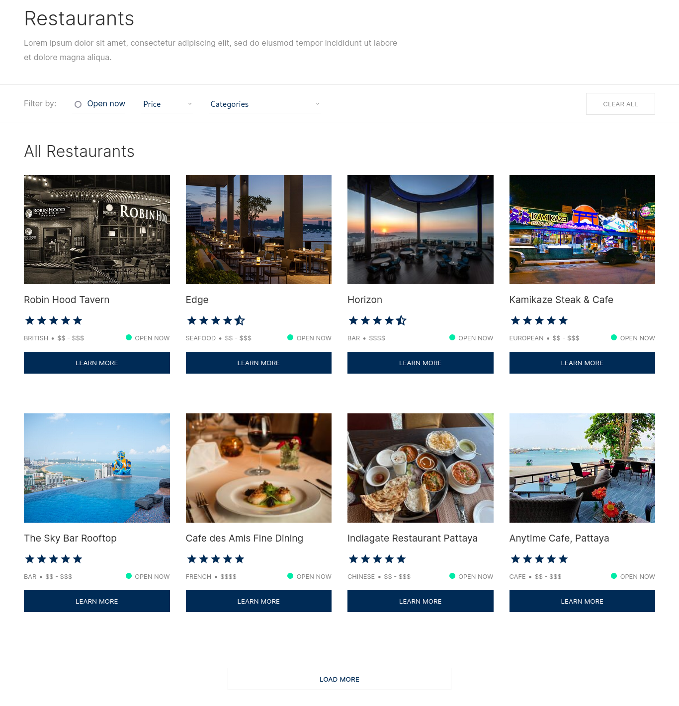
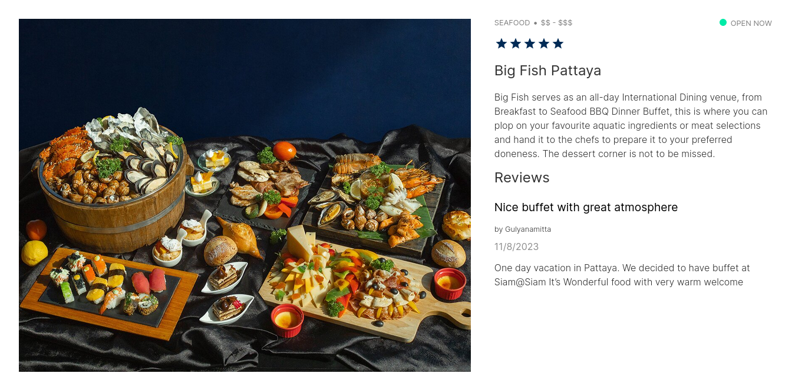

# Restaurants Catalog

Showing all restaurants in the world.

## Tools

-   ReactJS 18 (CRA with Vite)
-   NodeJS 18
-   Yarn package manager
-   Typescript
-   SASS CSS Preprocessor

## Goals

-   Similar to the UI design provided (99%)
-   Api Integration
-   Data filter: client side & server side

## Screenshots

## How To Start Project

1. Install NodeJS 18
2. Clone this repository

`git clone https://github.com/zaarza/FrontendDevReactjs-ArzaqulMughny`

3. Install packages/dependencies

`yarn install`

4. Run

-   In development mode
    `yarn dev`, open url: _localhost:5173_
-   or In production mode `yarn build` then `yarn preview`, open url: _localhost:4173_
